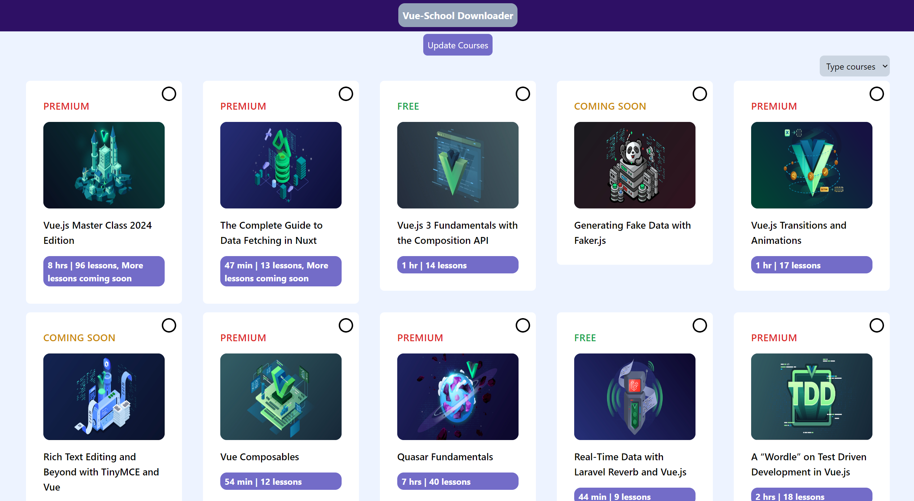

# VUESCHOOL DOWNLOADER WEB UI

This project is a web-based UI web scraper, created to address the difficulty of finding open-source projects that can download video courses from the website [Vue School](https://vueschool.io/).

## Getting Started

These instructions will give you a copy of the project up and running on your local machine

### Prerequisites

- [Node js 18+](https://nodejs.org/en/download/package-manager)
- NPM

### Instalation

1. Clone repo

```
git clone https://github.com/ndriodna/vueschool-downloader-web-ui
```

2. Install package

```
 npm install
```

3. Run Project

```
npm run dev
```

4. Open Project

```
http://localhost:5173/
```

<br>

## Preview



others preview 👉 [screenshot](screenshot)

## API Installation check here 👇

> https://github.com/ndriodna/api-vueschool-downloader

<br>

## Credits

This software uses the following open source packages:

- [vue](https://vuejs.org/)
- [axios](https://axios-http.com/)
- [pinia](https://pinia.vuejs.org/)
- [vue-cookies](github.com/cmp-cc/vue-cookies)
- [vue-router](https://router.vuejs.org/)
